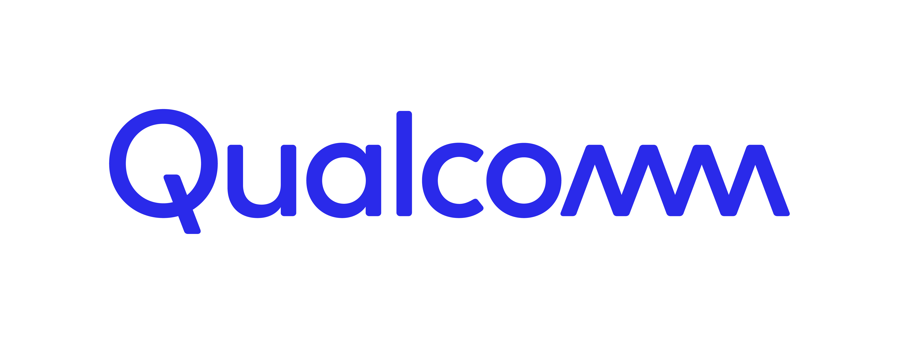
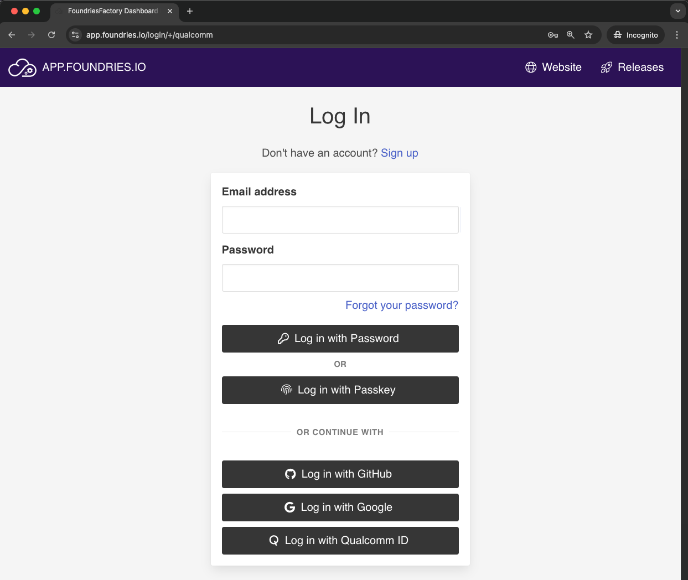
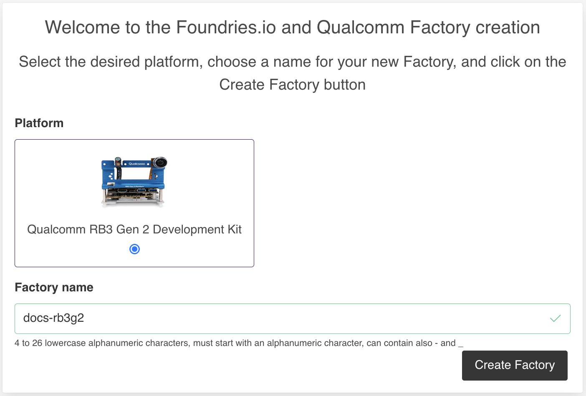
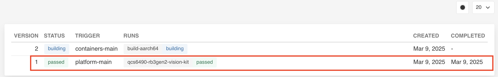
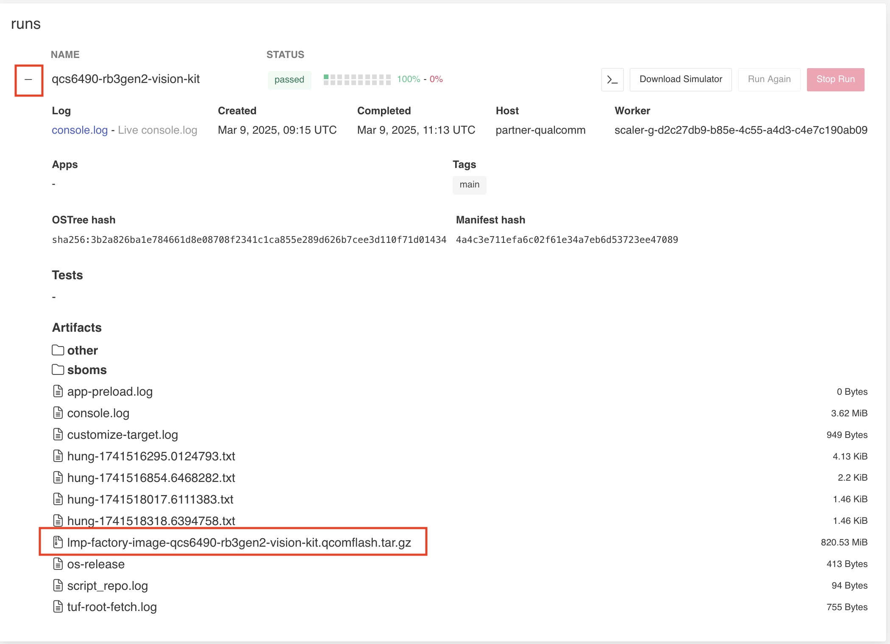

# _Simplify the chaos of developing, securing, and updating Linux-based IoT and Edge devices_

# _Quick Start Guide_
<p href="https://www.qualcomm.com/">
    
</p>

Unlock the potential of your IoT and Edge device development with the powerful partnership of Qualcomm and Foundries.io!
Our comprehensive end-to-end DevSecOps platform is designed for embedded developers like you,
helping your projects to be efficient, more secure, and scalable.

This guide covers everything from creating your Factory, to flashing, booting, and testing your AI applications.

## Table of Contents

- [Document Revision History](#document-revision-history)
- [Definitions, Acronyms, and Abbreviations](#definitions-acronyms-and-abbreviations)
- [Getting Started](#getting-started)
  - [Create an Account](#create-an-account)
  - [Create a Factory](#create-a-factory)
  - [Members Tab](#members-tab)
  - [Fioctl Installation](#fioctl-installation)
  - [Configure git](#configure-git)
  - [Qualcomm® Robotics RB3 Gen 2 Development Kit](#qualcomm-robotics-rb3g2-development-kit)
    - [Serial Console](#rb3-gen-2-serial-console)
    - [Connect via WiFi](#rb3-gen-2-connect-via-wifi)
    - [Enabling Ethernet and USB](#rb3-gen-2-enabling-ethernet-and-usb)
    - [SSH](#rb3-gen-2-ssh)
  - [Qualcomm® IQ-9075 Evaluation Kit](#qualcomm-iq-9075-evaluation-kit)
  - [Qualcomm® Qualcomm® Ride SX Beta Evaluation Kit](#qualcomm-ride-sx-beta-evaluation-kit)
  - [Qualcomm® Qualcomm® ADP Air Beta Evaluation Kit](#qualcomm-adp-air-beta-evaluation-kit)
  - [Register Your Device](#register-your-device)
- [Developer Workflows](#developer-workflows)
  - [Git Repositories](git-repositories)
- [Qualcomm® AI Hub](#qualcomm-ai-hub)
- [Compose-Apps](#compose-apps)
  - [IMSDK AI Sample Applications](#imsdk-ai-sample-applications)
  - [IMSDK Multimedia Sample Applications](#imsdk-multimedia-sample-applications)
- [Fioctl Examples](#fioctl-examples)
- [FoundriesFactory Images](#foundriesfactory-images)
  - [LmP Factory Image](#lmp-factory-image)
- [Wireguard VPN](#wireguard-vpn)
- [Updating FoundriesFactory Images](#updating-foundriesfactory-images)
- [Useful Links](#useful-links)

## Document Revision History

| Version | Date       | Comments                   |
|---------|------------|----------------------------|
| v0.1    | 2024-07-01 | Initial release            |
| v0.2    | 2025-03-10 | Adding pictures and videos |
| v0.3    | 2025-09-23 | Updates for QLI1.5         |

## Definitions, Acronyms, and Abbreviations

| Variable        | Meaning                                                           |
|-----------------|-------------------------------------------------------------------|
| `<factory>`     | Your Factory name                                                 |
| `<device_name>` | Device name used when you registered the device                   |
| `<app_name>`    | Docker-compose app available to run on the device                 |
| `<tag_name>`    | The branch you want your device to follow                         |
| `<IP>`          | Device IP                                                         |

## Getting Started

Access the link below and follow the instructions to sign up and create your Factory. 
<https://app.foundries.io/factories/+/qualcomm>

### Create an Account

Create a new account if you do not have one, or continue with your existing Github or Google account.

<p align="center">
    
</p>
<p align="center">Sign-Up</p>

### Create a Factory

1. Select the platform \*
2. Name your Factory
3. Click the Create Factory button

_\* If you want to try FoundriesFactory on a different Qualcomm platform,
create the Factory as suggested for Qualcomm RB3 Gen 2 Development Kit and contact Foundries.io at contact@foundries.io._

<p align="center">
    
</p>
<p align="center">Platform Selection</p>

NOTE: Based on the selected platform, the `<machine-name>` changes as shown in the table below:

| Device Name                           | `<machine-name>`             |
| ------------------------------------- | ---------------------------- |
| Qualcomm® RB3 Gen 2                   | `qcs6490-rb3gen2-vision-kit` |
| Qualcomm® IQ-9075 Evaluation Kit      | `qcs9075-iq-9075-evk`        |
| Qualcomm® Ride SX Beta Evaluation Kit | `qcs9100-ride-sx`            |
| Qualcomm® ADP Air Beta Evaluation Kit | `qcs615-adp-air`             |

### Members Tab

The Factory owners may invite additional users to their account via email under the "Members" tab of the Factory interface.
    - Manage your Factory users: ```https://app.foundries.io/factories/<factory>/members/```

### Fioctl Installation

Fioctl™ is a simple tool for interacting with the Foundries.io™ REST API.
- [Fioctl CLI Installation](https://docs.foundries.io/latest/getting-started/install-fioctl/index.html#gs-install-fioctl)

### Configure git

After Fioctl is properly setup, use its Git credential helper to allow pushing to your repos with FoundriesFactory.
- [Configuring Git](https://docs.foundries.io/latest/getting-started/git-config/index.html#gs-git-config)

**Note**: On macOS, you may encounter authentication issues due to Git on OSX using the Keychain Access Utility.
The solution is to remove Keychain Access entries from your git config file.

### Qualcomm® Robotics RB3G2 Development Kit

Once creating your Factory, it will build the source code for the RB3G2 and produce a Target.
A Target is a over-the-air update that can provide the build artifacts for initial provisioning.

1. Navigate To the Targets Section of Your Factory
Click the latest Targets with the platform-main trigger.

<p align="center">
    
</p>
<p align="center">Platform Main</p>

Expand the run in the Runs section and download the Factory image.

- `lmp-factory-image-qcs6490-rb3gen2-vision-kit.qcomflash.zip`

<p align="center">
    
</p>
<p align="center">Factory Image</p>

2. Extract the `tar.gz`.
3. Open a terminal and change the directory into `lmp-factory-image-qcm6490`.
4. The compressed archive contains the flashing tool `qdl`.
   - Note: The tool from the build has the interpreter set incorrectly.
5. Download and compile qdl for your platform:
   - `git clone https://github.com/linux-msm/qdl`
   - Read the README and install build dependencies
   - `cd qdl`
   - `make`
6. Disable ModemManager on some host systems if necessary.

Now configure the Qualcomm® Robotics RB3G2 Development Kit:

1. Set up `DIP_SW_0` positions 1 and 2 to `ON`.
   This enables serial output to the debug port.
2. Connect the USB debug cable to the host.
   Baud rate is 115200.
   - You can use your favorite UART client to access the console, such as minicom, putty etc.
3. The serial connection is based on the FTDI chip:
   - `/dev/serial/by-id/usb-FTDI_FT230X_Basic_UART_<serial ID>-if00-port0`
4. Plug in the USB-C cable from the host.
5. Run the command to flash:
   - `./qdl --debug prog_firehose_ddr.elf rawprogram*.xml patch*.xml`
6. Press and hold the F_DL button and connect the power cable.

#### RB3 Gen 2: Serial Console

After flashing, the device should boot the Linux microPlatform.
Use your serial console to log in.

Username: `fio`
Password: `fio`

#### RB3 Gen 2: Connect via WiFi

Using the WiFi radio, connect it to the internet using NetworkManager CLI:

```
sudo nmcli device wifi connect "<AP Name>" password "<AP password>"
```

The sudo password is `fio`.

#### RB3 Gen 2: Enabling Ethernet and USB

In order to enable Ethernet, provide firmware in the Yocto recipe below.
This is a one time operation, which will also enable the USB type A ports to function

Register and log in to https://www.renesas.com, then [download firmware](https://www.renesas.com/us/en/products/interface/usb-switches-hubs/upd720201-usb-30-host-controller).

Once downloaded, copy USB3-201-202-FW-20131112.zip at recipes-firmware/firmware/renesas-upd720201
and add the renesas-upd720201 package to your image.

##### Add Firmware zip to the Correct Layer Location

```bash
git clone https://source.foundries.io/factories/<factory>/meta-subscriber-overrides.git
cd meta-subscriber-overrides
mkdir -p recipes-firmware/firmware/renesas-upd720201
cp /tmp/USB3-201-202-FW-20131112.zip recipes-firmware/firmware/renesas-upd720201
echo 'FILESEXTRAPATHS:prepend := "${THISDIR}/${PN}:"' > recipes-firmware/firmware/renesas-upd720201_20131112.bbappend
echo 'SRC_URI += "file://USB3-201-202-FW-20131112.zip"' >> recipes-firmware/firmware/renesas-upd720201_20131112.bbappend
```
##### Add renesas-upd720201 to lmp-factory-image

```bash
echo 'CORE_IMAGE_BASE_INSTALL += "renesas-upd720201"' >> recipes-samples/images/lmp-factory-image.bb
```
##### Commit and Push to Create a new Build
```bash
git add .
git commit -s -m "renesas-upd720201: add firmware file"
git push
```

After you push, the FoundriesFactory will build a new target. Once built, any registered device will update over the air.

#### RB3 Gen 2: SSH

Once connected to the network you can log in over ssh if desired:

```bash
qcs6490-rb3gen2-vision-kit.local 
```

OR

```bash
ssh fio@<IP>
```

Password: `fio`

---

### Qualcomm® IQ-9075 Evaluation Kit

Support for the IQ-9075 EVK with qcs9075 is in the beta phase and more information will be added here in the future.

---

### Qualcomm® Ride SX Beta Evaluation Kit

Support for the Ride SX Beta EVK with qcs9100 is in the beta phase and more information will be added here in the future.

---

### Qualcomm® ADP Air Beta Evaluation Kit

Support for the ADP Air Beta EVK with QCS615 is in the beta phase and more information will be added here in the future.

---

### Register Your Device

[Register your device](https://docs.foundries.io/latest/getting-started/register-device/index.html)

---

## Developer Workflows

Your Factory produces Targets, which are references to platform images and Docker applications.

Find your Factory source code at:
- `https://source.foundries.io/factories/<factory>/`

Find The built Targets at:
- `https://app.foundries.io/factories/<factory>/targets/`

### Git Repositories:

1. `ci-scripts.git`: Configures your factory branches - `factory-config.yml`
2. `containers.git`: Contains the source code for your Docker applications
3. `lmp-manifest.git`: Yocto manifest for your platform build
4. `meta-subscriber-overrides.git`: Yocto layer which overrides the Linux microPlatform

---

## Qualcomm® AI Hub

[Qualcomm® AI Hub](https://aihub.qualcomm.com/get-started) simplifies deploying AI models for vision, audio, and speech applications to edge devices.
You can optimize, validate, and deploy your own AI models on hosted Qualcomm platform devices within minutes.

Please see our [Getting Started](#getting-started) guide to start using a Factory with AIHub.

The applications below which have a prefix of `gst-ai` use the models from [AIHub](https://aihub.qualcomm.com) and have been packaged into the `qimsdk-lmp` image in your Factory.

- If you are curious how this process works, refer to `https://source.foundries.io/<factory>/containers.git/tree/qimsdk-lmp/Dockerfile`
- Should you want to add or replace a model from [AIHub](https://aihub.qualcomm.com),
  modify the `qimsdk-lmp` Dockerfile and add a `RUN` command to download the file into `/src/models/` inside the container.
  - During runtime, the models will be placed in `/opt/models` and can be referenced in the Compose command to instruct the application to use a specific model.
  - Please review the `gst-ai-classification` `docker-compose.yml` in `https://source.foundries.io/<factory>/containers.git` as an example of how to run a different model.

## Compose Apps

Compose Apps fill the gap for Factory devices in distributing applications.

- Build your own [Compose Apps](https://docs.foundries.io/latest/reference-manual/docker/compose-apps.html).
- Your Factory also has some sample Apps ready to deploy.

#### Httpd Server App

This is a simple httpd server, built from a Dockerfile in the Factory source code.

To enable the `shellhttpd` Compose App before deployment:

```bash
git clone https://source.foundries.io/factories/<factory>/containers.git
git mv shellhttpd.disabled shellhttpd
git commit -s -m "enable shellhttp" && git push
```

This app does not require any hardware other than a network connection.

#### Qualcomm IMSDK GStreamer Development Container

This is a development container for the gstreamer applications listed below.
It provides the assembled binaries, models, and video files for the applications to consume.
If you want to build your own gstreamer pipeline application, this would be the place to start.

For more information, please see the project's [README](https://github.com/foundriesio/qimsdk-lmp/blob/main/README.md).

### IMSDK AI Sample Applications

#### Image Classification

The image classification application (`gst-ai-classification`) allows you to identify the subject in an image.
The use cases are implemented using the Qualcomm Neural Processing SDK, LiteRT, or Qualcomm AI Engine direct models.
The Compose file provides you a few commands you can comment/uncomment to use different models for classification.

For a detailed description see [Qualcomm Linux Sample Apps](https://docs.qualcomm.com/bundle/publicresource/topics/80-70020-50/gst-ai-classification.html).

[](https://www.youtube.com/watch?v=L1t0hqYkM_4)

To enable the `gst-ai-classification` Compose App:

```bash
git clone https://source.foundries.io/factories/<factory>/containers.git
git mv gst-ai-classification.disabled gst-ai-classification
git commit -s -m "gst-ai-classification" && git push
```

This app requires a connected display and the camera mezzanine to function properly.

#### Object Detection

The object detection application (`gst-ai-object-detection`) allows you to detect objects within images and videos.
The use cases show the execution of YOLOv5, YOLOv8, and YOLOX using the Qualcomm Neural Processing SDK runtime, YOLOv8 using Qualcomm AI Engine direct, and YOLOv5 and YOLOv8 using LiteRT.

For a detailed description see [Qualcomm Linux Sample Apps](https://docs.qualcomm.com/bundle/publicresource/topics/80-70020-50/gst-ai-object-detection.html).

[](https://www.youtube.com/watch?v=Fax6rqp1YeI)

To enable the `gst-ai-object-detection` Compose App:

```bash
git clone https://source.foundries.io/factories/<factory>/containers.git
git mv gst-ai-object-detection.disabled gst-ai-object-detection
git commit -s -m "gst-ai-object-detection" && git push
```

This app requires a connected display and the camera mezzanine to function properly.

#### Pose Detection

The pose detection application (`gst-ai-pose-detection`) allows you to detect the body pose of the subject in an image or video.
The use case processes input streams from a camera, file, or an RTSP source, use LiteRT and Qualcomm AI Engine direct models for pose detection,
and display the results on the screen.

For a detailed description see [Qualcomm Linux Sample Apps](https://docs.qualcomm.com/bundle/publicresource/topics/80-70020-50/gst-ai-pose-detection.html).

[](https://www.youtube.com/watch?v=eDf4BoL6dKQ)

To enable the `gst-ai-pose-detection` Compose App:

```bash
git clone https://source.foundries.io/factories/<factory>/containers.git
git mv gst-ai-pose-detection.disabled gst-ai-pose-detection
git commit -s -m "gst-ai-pose-detection" && git push
```

This app requires a connected display and the camera mezzanine to function properly.

#### Image Segmentation

The image segmentation application (`gst-ai-segmentation`) allows you to divide an image into different and meaningful parts or segments,
and assign a label to each homogenous segment based on the similarity of the attributes.
The application uses Qualcomm Neural Processing SDK runtime, Qualcomm AI Engine direct runtime, and LiteRT for image segmentation.

For a detailed description see [Qualcomm Linux Sample Apps](https://docs.qualcomm.com/bundle/publicresource/topics/80-70020-50/gst-ai-segmentation.html).

[](https://www.youtube.com/watch?v=QJTRbk2hv2Y)

Enable the `gst-ai-segmentation` Compose App:

```bash
git clone https://source.foundries.io/factories/<factory>/containers.git
git mv gst-ai-segmentation.disabled gst-ai-segmentation
git commit -s -m "gst-ai-segmentation" && git push
```

This app requires a connected display and the camera mezzanine to function properly.

#### Parallel Inferencing

The parallel inferencing application (`gst-ai-parallel-inference`) allows you to perform object detection, object classification, pose detection,
and image segmentation on an input stream from different sources such as a camera, a file, or an RTSP network.
The use cases implement the LiteRT models for object detection, image segmentation, classification, and pose detection.

For a detailed description see [Qualcomm Linux Sample Apps](https://docs.qualcomm.com/bundle/publicresource/topics/80-70020-50/gst-ai-parallel-inference.html).

[](https://www.youtube.com/watch?v=Uxk4xZtPi9Y)

Enable the `gst-ai-parallel-inference` Compose App:

```bash
git clone https://source.foundries.io/factories/<factory>/containers.git
git mv gst-ai-parallel-inference.disabled gst-ai-parallel-inference
git commit -s -m "gst-ai-parallel-inference" && git push
```

This app requires a connected display and the camera mezzanine to function properly.

#### Daisy Chain Detection and Classification

The daisy chain detection and classification application (`gst-ai-daisychain-detection-classification`) allows you to perform
cascaded object detection and classification with a camera, file source, or RTSP stream.
The use cases involve detecting objects and classifying the detected objects.

For a detailed description see [Qualcomm Linux Sample Apps](https://docs.qualcomm.com/bundle/publicresource/topics/80-70020-50/daisy-chain-detection-and-classification.html).

[](https://www.youtube.com/watch?v=WWgbooxy6sE)

To enable the `gst-ai-daisychain-detection-classification` Compose App:

```bash
git clone https://source.foundries.io/factories/<factory>/containers.git
git mv gst-ai-daisychain-detection-classification.disabled gst-ai-daisychain-detection-classification
git commit -s -m "gst-ai-daisychain-detection-classification" && git push
```

This app requires a connected display and the camera mezzanine to function properly.

### Daisy Chain Detection and Pose Estimation

The daisy chain detection and classification application (`gst-ai-daisychain-detection-pose`) allows you to perform
cascaded object detection and pose detection with a camera, file source, or an RTSP stream.
The use cases involve detecting objects and estimating the body poses of the subject in an image or a video.

For a detailed description see [Qualcomm Linux Sample Apps](https://docs.qualcomm.com/bundle/publicresource/topics/80-70020-50/daisy-chain-detection-and-pose-detection.html).

To enable the `gst-ai-daisychain-detection-pose` Compose App:

```bash
git clone https://source.foundries.io/factories/<factory>/containers.git
git mv gst-ai-daisychain-detection-pose.disabled gst-ai-daisychain-detection-pose
git commit -s -m "gst-ai-daisychain-detection-pose" && git push
```

This app requires a connected display and the camera mezzanine to function properly.

#### Monodepth From Video

The monodepth from video application (`gst-ai-monodepth`) allows you to infer depth of a source feed from a live camera stream, file, or an RTSP stream.

For detailed description see [Qualcomm Linux Sample Apps](https://docs.qualcomm.com/bundle/publicresource/topics/80-70020-50/mono-depth-from-video.html).

[](https://www.youtube.com/watch?v=ddw2JM5ySQ0)

To enable the `gst-ai-monodepth` Compose App:

```bash
git clone https://source.foundries.io/factories/<factory>/containers.git
git mv gst-ai-monodepth.disabled gst-ai-monodepth
git commit -s -m "gst-ai-monodepth" && git push
```

This app requires a connected display and the camera mezzanine to function properly.

#### Face Detection

The face detection application (`gst-ai-face-detection`) collects the live video input from a camera, file, or an RTSP stream and
uses the Qualcomm AI Engine direct and LiteRT face detection models to produce a preview with the overlaid AI model output on the HDMI display.

For a more detailed description please see [Qualcomm Linux Sample Apps](https://docs.qualcomm.com/bundle/publicresource/topics/80-70020-50/gst-ai-face-detection.html).

```bash
git clone https://source.foundries.io/factories/<factory>/containers.git
git mv gst-ai-face-detection.disabled gst-ai-face-detection
git commit -s -m "gst-ai-face-detection" && git push
```

This app requires a connected display and the camera mezzanine to function properly.

#### Face Recognition

The face recognition application (`gst-ai-face-recognition`) collects the live video input from a camera or an RTSP stream and
shares this input for face detection, facial landmarking, and face recognition.
It uses the `face_det_quantized` models for face detection, `facemap_3dmm_quantized` model for facial landmarking,
and `face_attrib_net_quantized` model for face recognition labels.

The result is a preview of the overlaid AI model on the HDMI display.

For a more detailed description please see [Qualcomm Linux Sample Apps](https://docs.qualcomm.com/bundle/publicresource/topics/80-70020-50/gst-ai-face-recognition.html).
Please note: To run this sample, you will need to register facial recognition data: https://docs.qualcomm.com/bundle/publicresource/topics/80-70020-50/gst-ai-face-recognition.html

```bash
git clone https://source.foundries.io/factories/<factory>/containers.git
git mv gst-ai-face-recognition.disabled gst-ai-face-recognition
git commit -s -m "gst-ai-face-recognition" && git push
```

This app requires a connected display and the camera mezzanine to function properly.

### IMSDK Multimedia Sample Applications

#### Video Wall

The video wall command-line application (`gst-concurrent-videoplay-composition`) facilitates concurrent video decoding and playback for advanced video coding (AVC)-coded videos,
and performs composition on a display for the video wall application.
This application requires at least one input video file, which is expected to be an MP4 file with the AVC codec.

For a more detailed description please see [Qualcomm Linux Sample Apps](https://docs.qualcomm.com/bundle/publicresource/topics/80-70020-50/gst-concurrent-videoplay-composition.html).

[](https://www.youtube.com/watch?v=TGe8TS7-ZTw)

Enable the `gst-concurrent-videoplay-composition` Compose App before deployment:

```bash
git clone https://source.foundries.io/factories/<factory>/containers.git
git mv gst-concurrent-videoplay-composition.disabled gst-concurrent-videoplay-composition
git commit -s -m "gst-concurrent-videoplay-composition" && git push
```

This compose-app requires a connected display to function properly.

#### Multiple Camera Streaming

The multiple camera streaming application (`gst-multi-camera-example`) enables simultaneous streaming from two camera sensors.
It composes camera feeds side-by-side to display on a screen, or encodes and stores the video streams to file.
Typical use cases that need multiple camera inputs are dash cameras or stereo cameras, which can use this app as a reference.

For a detailed description see [Qualcomm Linux Sample Apps](https://docs.qualcomm.com/bundle/publicresource/topics/80-70018-50/gst-multi-camera-stream-example.html?vproduct=1601111740013072&version=1.4&facet=Qualcomm%20Intelligent%20Multimedia%20SDK).

[](https://www.youtube.com/watch?v=k7Gg_kdIbFg)

Enable the `gst-multi-camera-example` Compose App:

```bash
git clone https://source.foundries.io/factories/<factory>/containers.git
git mv gst-multi-camera-example.disabled gst-multi-camera-example
git commit -s -m "gst-multi-camera-example" && git push
```

This App requires a connected display and the camera mezzanine to function properly.

#### Deploy

After you push, your Factory will build a new Target.
Afterwaards, deploy as described below.

## Fioctl Examples

To deploy the applications listed below, you must have enabled them as described above.
Default polling time on devices is five minutes.
Once you have issued your deployment command, please wait up to five minutes to see the change reflected.

#### View Targets:

  ```bash
  ./fioctl targets list -f <factory>
  ```

#### View Devices:

  ```bash
  ./fioctl devices list -f <factory>
  ```

#### Change Device Tag:

  ```bash
  ./fioctl devices -f <factory> config updates <device_name> --tags <tag_name>
  ```

#### Change Device Application:

  ```bash
  ./fioctl devices -f <factory> config updates <device_name> --apps <app_name1>,<app_name2>,<app_name3>
  ```

#### Deploy shellhttpd Application:

  ```bash
  ./fioctl devices -f <factory> config updates <device_name> --apps shellhttpd
  ```

#### Deploy gst-concurrent-videoplay-composition Application:

  ```bash
  ./fioctl devices -f <factory> config updates <device_name> --apps gst-concurrent-videoplay-composition
  ```

#### Deploy gst-ai-classification Application:

  ```bash
  ./fioctl devices -f <factory> config updates <device_name> --apps gst-ai-classification
  ```

#### Deploy gst-ai-daisychain-detection-classification Application:

  ```bash
  ./fioctl devices -f <factory> config updates <device_name> --apps gst-ai-daisychain-detection-classification
  ```

#### Deploy gst-ai-monodepth Application:

  ```bash
  ./fioctl devices -f <factory> config updates <device_name> --apps gst-ai-monodepth
  ```

#### Deploy gst-ai-object-detection Application:

  ```bash
  ./fioctl devices -f <factory> config updates <device_name> --apps gst-ai-object-detection
  ```

#### Deploy gst-ai-parallel-inference Application:

  ```bash
  ./fioctl devices -f <factory> config updates <device_name> --apps gst-ai-object-detection
  ```

#### Deploy gst-ai-pose-detection Application:

  ```bash
  ./fioctl devices -f <factory> config updates <device_name> --apps gst-ai-pose-detection
  ```

#### Deploy gst-ai-segmentation Application:

  ```bash
  ./fioctl devices -f <factory> config updates <device_name> --apps gst-ai-segmentation
  ```

#### Deploy gst-multi-camera-example Application:

  ```bash
  ./fioctl devices -f <factory> config updates <device_name> --apps gst-multi-camera-example
  ```

#### Enable/Disable Wireguard VPN:

  ```bash
  ./fioctl devices -f <factory> config wireguard <device_name> enable/disable
  ```

---

## Factory Images

### LmP Factory Image

This [image configuration](https://source.foundries.io/factories/<factory>/meta-subscriber-overrides.git/tree/recipes-samples/images/lmp-factory-image.bb?h=main) includes the required packages to bake into the final image.
---

## Wireguard VPN

Registered devices can form a VPN to [allow remote access—even behind firewalls](https://docs.foundries.io/latest/reference-manual/remote-access/wireguard.html).

---

## Updating Factory Images

[Steps for updating your Factory](https://docs.foundries.io/latest/reference-manual/linux/linux-update.html).

---

## Useful Links

- [Extending the LmP](https://docs.foundries.io/latest/user-guide/lmp-customization/linux-extending.html)
- [SBOMs](https://docs.foundries.io/latest/reference-manual/factory/sboms.html)
- [Factory Containers](https://docs.foundries.io/latest/user-guide/containers-and-docker/containers.html).
